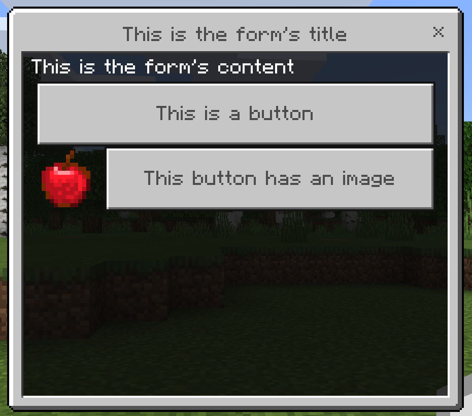
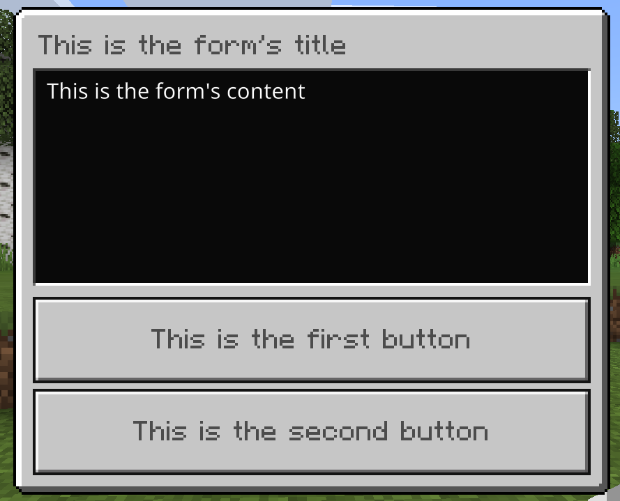

# BDSX - Forms documentation

# Introduction

## Form types

There are currently 3 form types in the game :

- Simple Form

- Modal Form

- Custom Form

The three of them have their advantages and disadvantages.

There is no "best" form, it all depends on the use case.

#### Simple Forms

Simple Forms are the most common type of form you'll encounter. They consist of :

- A title

- Text content

- Button(s)

Simple Forms allow you to add as many buttons as you like, and customize them with images (that are next to buttons)



#### Modal Forms

Modal Forms consist of :

- A title

- Text content

- 2 buttons

Modal Forms always contain 2 buttons, that cannot have images.



Notice how there is no "cross" to exit the form at the top right, unlike Simple Forms. This is because Modal Forms are usually used for confirmation dialogs (yes/no or similar)

#### Custom Forms

Custom Forms are the most customizable type of form. They consist of :

- A title

- A "submit" button that you cannot customize

And plenty of components that you can add to the form :

- Labels (Text content)

- Dropdowns

- Inputs (Text input areas)

- Sliders

- Step Sliders

- Toggles

But... for some reason you cannot add buttons to custom forms. All custom forms have a "submit" button, but you cannot customize it.


---

# Forms data

Forms are JSON data. With BDSX, there are two manners of generating this data :

- Writing the JSON data yourself

- Using BDSX API to generate the data for you

You would think using the API is better. It is indeed simpler but I personnally like to write the data by hand since i find it more readable.

## Returned data

Forms return data after the player interacts with them.

#### Simple Forms

Simple Forms return an `integer` corresponding to the index of the button the player pressed. If the player closed the form (with the cross at the top right, or by hitting escape for example), `null` is returned.

#### Modal Forms

Modal Forms return a `boolean` corresponding to the button that the player pressed. The first button (top one) of modal forms returns `true`. The second one returns `false`. Modal forms don't have a cross to close them. However, if the player somewhat closes the form (by hitting escape for example), `false` is returned.

#### Custom Forms

Custom Forms return an `array` containing the data of the form's components. Refer to the section below to see what each component returns. If the player closed the form, `null` is returned.

---

# Forms components

## Simple Forms

#### Button

Description : A clickable button

Provided data :

| Name         | Type            | Requirement                   | Description                                                           |
| ------------ | --------------- | ----------------------------- | --------------------------------------------------------------------- |
| `text`       | string          | required                      | Text of the button                                                    |
| `image`      | json object     | optional                      | Image displayed next to the button                                    |
| `image.type` | "path" or "url" | required if image is provided | Image type.<br/>path : local texture file.<br/>url : url of the image |
| `image.data` | string          | required if image is provided | image path or url                                                     |

##### Implementation

Using BDSX API

```typescript
form.addButton(new FormButton("This is a button"));
form.addButton(new FormButton("This button has an image", "path", "textures/items/apple"));
```

Using JSON

```json
"buttons":[
   {
      "text":"This is a button"
   },
   {
      "text":"This button has an image",
      "image":{
         "type":"path",
         "data":"textures/items/apple"
      }
   }
]
```


## Custom Forms

#### Label

Description : Text content

Provided data :

| Name   | Type   | Requirement | Description          |
| ------ | ------ | ----------- | -------------------- |
| `text` | string | required    | Text to be displayed |

Returned data : `null`

##### Implementation

Using BDSX API :

```typescript
form.addComponent(new FormLabel("This is a label"));
```

Using JSON :

```json
"content":[
   {
      "type":"label",
      "text":"This is a label"
   }
]
```


#### Dropdown

Description : A dropdown menu letting the player choose an option between different options

Provided data :

| Name      | Type     | Requirement                      | Description                       |
| --------- | -------- | -------------------------------- | --------------------------------- |
| `text`    | string   | required                         | Text displayed above the dropdown |
| `options` | string[] | required                         | Options to choose from            |
| `default` | integer  | optional<br/>(0 if not provided) | Index of the default option       |

Returned data :

| Type    | Description                |
| ------- | -------------------------- |
| integer | Index of the chosen option |

##### Implementation

Using BDSX API :

```typescript
form.addComponent(new FormDropdown("This is a dropdown", ["option 1", "option 2", "option 3"], 0));
```

Using JSON :

```json
"content":[
   {
      "type":"dropdown",
      "text":"This is a dropdown",
      "options":[
         "Option 1",
         "Option 2",
         "Option 3"
      ],
      "default":0
   }
]
```


#### Input

Description : An input field letting the player input text

Provided data :

| Name          | Type   | Requirement | Description                                   |
| ------------- | ------ | ----------- | --------------------------------------------- |
| `text`        | string | required    | Text displayed above the input field          |
| `placeholder` | string | optional    | Placeholder text displayed in the input field |
| `default`     | string | optional    | Already entered text                          |

Returned data :

| Type   | Description                     |
| ------ | ------------------------------- |
| string | Entered text in the input field |

Note : if no text is entered `''` (empty string) will be returned.

##### Implementation

Using BDSX API :

```typescript
form.addComponent(new FormInput("This is an input", "placeholder", "text already entered"));
```

Using JSON :

```json
"content":[
   {
      "type":"input",
      "text":"This is an input",
      "placeholder":"Placeholder",
      "default":"already entered text"
   }
]
```


#### Slider

Description : A slider letting the player choose a value between a minimum and a maximum

Provided data :

| Name      | Type   | Requirements                                        | Description                     |
| --------- | ------ | --------------------------------------------------- | ------------------------------- |
| `text`    | string | required                                            | Text displayed above the slider |
| `min`     | number | required                                            | Minimum value of the slider     |
| `max`     | number | required                                            | Maximum value of the slider     |
| `step`    | number | optional <br/>(1 if not provided)                   | Step between values             |
| `default` | number | optional<br/>(minimum slider value if not provided) | Default value of the slider     |

Returned data :

| Type   | Description                  |
| ------ | ---------------------------- |
| number | Value selected by the player |

##### Implementation

Using BDSX API :

```typescript
form.addComponent(new FormSlider("This is a slider", 0, 100, 1, 0));
```

Using JSON :

```json
"content":[
   {
      "type":"slider",
      "text":"This is a slider",
      "min":0,
      "max":100,
      "step":1,
      "default":0
   }
]
```


#### Step Slider

Description : A slider letting the player choose between different values

Provided data :

| Name      | Type     | Requirement                      | Description                       |
| --------- | -------- | -------------------------------- | --------------------------------- |
| `text`    | string   | required                         | Text displayed above the slider   |
| `steps`   | string[] | required                         | Values to choose from             |
| `default` | integer  | optional<br/>(0 if not provided) | Index of the default slider value |

Returned data :

| Type    | Description                 |
| ------- | --------------------------- |
| integer | Index of the selected value |

##### Implementation

Using BDSX API :

```typescript
form.addComponent(new FormStepSlider("This is a step slider", ["step 1", "step 2", "step 3"], 0));
```

Using JSON :

```json
"content":[
   {
      "type":"step_slider",
      "text":"This is a step slider",
      "steps":[
         "step 1",
         "step 2",
         "step 3"
      ],
      "default":0
   }
]
```


#### Toggle

Description : A simple (on/off style) toggle

Provided data :

| Name      | Type    | Requirement                          | Description                     |
| --------- | ------- | ------------------------------------ | ------------------------------- |
| `text`    | string  | required                             | Text displayed above the toggle |
| `default` | boolean | optional<br/>(false if not provided) | Default toggle value            |

Returned data :

| Type    | Description                       |
| ------- | --------------------------------- |
| boolean | Toggle value chosen by the player |

##### Implementation

Using BDSX API :

```typescript
form.addComponent(new FormToggle("this is a toggle", false));
```

Using JSON :

```json
"content":[
   {
      "type":"toggle",
      "text":"This is a toggle",
      "default":false
   }
]
```

---

# Implementing forms

## Simple Forms

#### Using BDSX API

```typescript
const form = new SimpleForm();
        form.setTitle("This is the form's title");
        form.setContent("This is the form's content");
        form.addButton(new FormButton("This is a button"));
        form.addButton(new FormButton("This button has an image", "path", "textures/items/apple"));
        form.sendTo(NetworkID, async(data) => {
            //data can be processed here
            //here, data is the data returned. it contains all the form data.
            //Use data.response to get the form response data.
        });
```

#### Using JSON

```typescript
const data = await Form.sendTo(NetworkID, {
   "type":"form",
   "title":"This is the form's title",
   "content":"This is the form's content",
   "buttons":[
      {
         "text":"This is a button"
      },
      {
         "text":"This button has an image",
         "image":{
            "type":"path",
            "data":"textures/items/apple"
         }
      }
   ]
});
//data can be processed here
//here, data is the form response data.
```

## Modal Forms

#### Using BDSX API

```typescript
const form = new ModalForm();
        form.setTitle("This is the form's title");
        form.setContent("This is the form's content");
        form.setButtonConfirm("This is the button returning true");
        form.setButtonCancel("This is button returning false");
        form.sendTo(NetworkID, async (data) => {
            //data can be processed here
            //here, data is the data returned. it contains all the form data.
            //Use data.response to get the form response data.
        });
```

#### Using JSON

```typescript
const data = await Form.sendTo(NetworkID, {
   "type":"modal",
   "title":"This is the form's title",
   "content":"This is the form's content",
   "button1":"This is the button returning true",
   "button2":"This is the button returning false"
});
//data can be processed here
//here, data is the form response data.
```

## Custom Forms

#### Using BDSX API

```typescript
const form = new CustomForm();
        form.setTitle("This is the form's title");
        form.addComponent(new FormLabel("This is a label"));
        form.addComponent(new FormDropdown("This is a dropdown", ["option 1", "option 2", "option 3"], 0));
        form.addComponent(new FormInput("This is an input", "placeholder", "text already entered"));
        form.addComponent(new FormSlider("This is a slider", 0, 100, 1, 0));
        form.addComponent(new FormStepSlider("This is a step slider", ["step 1", "step 2", "step 3"], 0));
        form.addComponent(new FormToggle("this is a toggle", false));
        form.sendTo(NetworkID, async (data) => {
            //data can be processed here
            //here, data is the data returned. it contains all the form data.
            //Use data.response to get the form response data.
        });
```

#### Using JSON

```typescript
const data = await Form.sendTo(NetworkID, {
   "type":"custom_form",
   "title":"This is the form's title",
   "content":[
      {
         "type":"label",
         "text":"This is a label"
      },
      {
         "type":"dropdown",
         "text":"This is a dropdown",
         "options":[
            "Option 1",
            "Option 2",
            "Option 3"
         ],
         "default":0
      },
      {
         "type":"input",
         "text":"This is an input",
         "placeholder":"Placeholder",
         "default":"already entered text"
      },
      {
         "type":"slider",
         "text":"This is a slider",
         "min":0,
         "max":100,
         "step":1,
         "default":0
      },
      {
         "type":"step_slider",
         "text":"This is a step slider",
         "steps":[
            "step 1",
            "step 2",
            "step 3"
         ],
         "default":0
      },
      {
         "type":"toggle",
         "text":"This is a toggle",
         "default":false
      }
   ]
});
//data can be processed here
//here, data is the form response data.
```

---

# Labels

BDSX API allows you to map "labels" to your components. So instead of referring to them by their index, you can map them to a string.

#### Example with a Simple Form

```typescript
//[...]
form.addButton(new FormButton("This is the first button"));
form.addButton(new FormButton("This is the second button"));
```

Here, if the player clicks the first button, `data.response` will be `0`.

If the player clicks the second button, `data.response` will be `1`.

Now let's map labels to those buttons :

```typescript
//[...]
form.addButton(new FormButton("This is the first button"), "first");
form.addButton(new FormButton("This is the second button"), "second");
```

Here, if the player clicks the first button, `data.response` will be `"first"`.

If the player clicks the second button, `data.response` will be `"second"`.

Nice !

You can map labels to all form components except modal forms buttons.

---

##### Written by Se7en for the BDSX community

This code is licensed under GNU General Public License v3.0

Feel free to PR any mistakes/improvements !

if you have any questions add me on Discord : Se7en#9999
